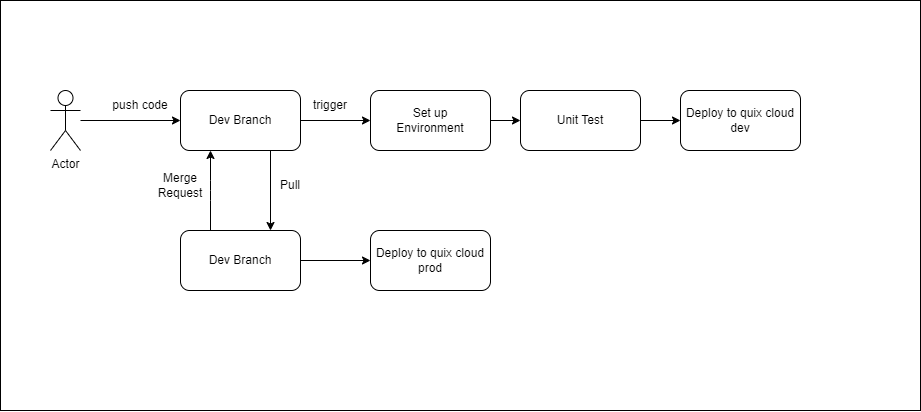

# IRIS_MLOPS
## **Serving API with Fastapi**

### **Prerequisites**
- Python 3.10
- uv
- Docker
- Make

### **Running Step**
1. Change directory to iris_api
```sh
cd iris_api
```
2. Create Environment with uv
```sh
make install
```
3. Train iris model and save artifact
```sh
make install
```
4. Run fastapi app to serve the trained iris model
- run in local uv environment
```sh
make local-run
```
- run in docker
```sh
make docker-run
```
5. Run unit test
```sh
make unit-test-run
```

## **CI/CD Pipeline**

### **Prerequisites**
- Github
- Quix cloud account
- Setup Secret variable for github action (DEV_WORKSPACE_ID, PROD_WORKSPACE_ID, QUIX_PAT) 
### **Overview**
This document describes the **Continuous Integration and Continuous Deployment (CI/CD)** workflow used to deploy applications to **Quix Cloud** environments (Dev & Prod). The workflow is triggered by push code to the dev branch and pull request merges to the main branch.
#### **1. Development Workflow (`dev` branch)**
A **developer (actor)** push changes to the **`dev` branch**. This triggers the following automated steps:
  1. **Set up Environment**: The pipeline installs dependencies and sets up the required runtime.
  2.  **Run Unit Tests**: The test suite is executed to ensure code correctness.
  3. **Deploy to Quix Cloud (Dev)**: If tests pass, the application is deployed to the **development** environment on Quix Cloud.
#### **2. Deployment to Production (`main` branch)**
Once development is complete, a **pull request (merge request)** is created to merge changes from `dev` → `main`. When the pull request is **merged**, this triggers:
  1. **Deploy to Quix Cloud (Prod)**: The application is deployed to the **production** environment on Quix Cloud.
### **Way to Improve**
-  Add Slack/Email Notifications
-  Implement Linting and Code Quality Checks
-  Automatic Rollbacks on Failure 